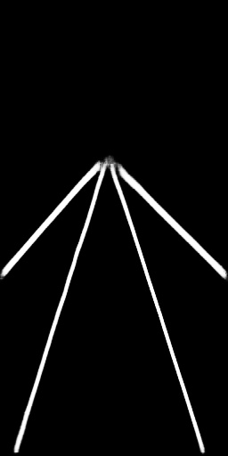
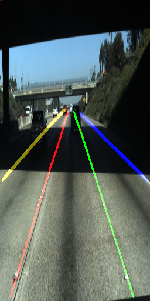
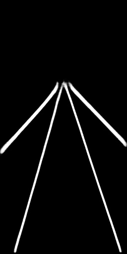
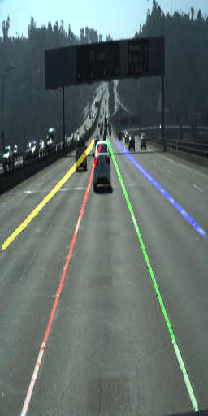
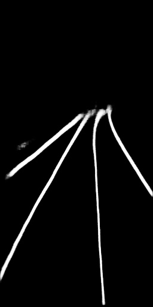
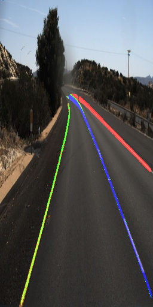

# 车道线检测

## Repo 结构：

    |
    |----README.md
    |
    |----model.py: 包含所有深度学习网络
    |
    |----loss.py: 各类损失函数
    |
    |----preprocess.py: 包含数据预处理函数
    |
    |----train.py:脚本用于模型训练
    |
    |----Data.py：包含Pytorch Dataset对象的定义
    |
    |----clustering.py:包括聚类算法
    |
    |----logs/
    |------|------models/:用于训练中模型及参数的保存
    |------|------loggings/:保存训练日志
    |
    |----data/
    |------|------cluster/:包含用于聚类的ground-truth数据
    |------|------train_binary/:包含用于车道线语意分割的ground-truth数据
    |------|------LaneImages/:包含相机拍摄的原始RGB数据
    |
    |----test_result/
    |------|-----binary/:包含语义分割测试结果
    |------|-----instance/:包含个体分割测试结果
    |

## 网络结构

## 样例

## 如何使用
### 训练
如需使用Tusimple数据从新训练，可按以下步骤执行
1. 解压数据至train_set文件夹
2. 运行preprocess.py获取语义分割与个体分割ground truth 数据
3. 输入适当参数，运行train.py即可，训练结果将被保存至test_result文件夹
### 预测
对图像frame的预测只需给定适当参数，并运行test.py即可. Pretrained的模型
已在logs/models中提供

## 后续规划
部分功能和改进，仍会不断加入，目前已有规划如下
1. 加入TensorRT或tvm优化
2. 加入视频流预测
3. 评估SCNN算法
4. 其它参数设定下的训练

