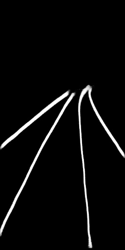
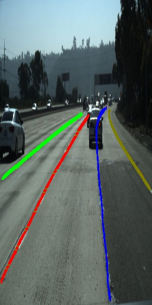

# 车道线检测

## Repo 结构：

    |
    |----README.md
    |
    |----model.py: 包含所有深度学习网络
    |
    |----loss.py: 各类损失函数
    |
    |----preprocess.py: 包含数据预处理函数
    |
    |----train.py:脚本用于模型训练
    |
    |----Data.py：包含Pytorch Dataset对象的定义
    |
    |----clustering.py:包括聚类算法
    |
    |----logs/
    |------|------models/:用于训练中模型及参数的保存
    |------|------loggings/:保存训练日志
    |
    |----data/
    |------|------cluster/:包含用于聚类的ground-truth数据
    |------|------train_binary/:包含用于车道线语意分割的ground-truth数据
    |------|------LaneImages/:包含相机拍摄的原始RGB数据
    |
    |----test_result/
    |------|-----binary/:包含语义分割测试结果
    |------|-----instance/:包含个体分割测试结果
    |

## 网络结构

## 样例
Solarized dark             |  Solarized Ocean
:-------------------------:|:-------------------------:
 | 
| 

## 项目细节及进度
- [x] LaneNet 模型构建
- [x] HNet 模型构建
- [x] 测试数据集清洗和生成(Tusimple Dataset)
- [x] 预测阶段聚类算法的实现
- [x] 构建训练和评估pipeline
- [x] 模型训练，debug与调参
- [ ] 加入TensorRT模型加速

